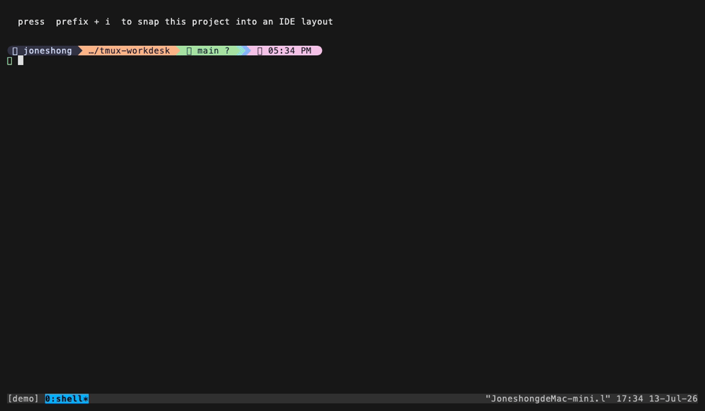

# tmux-workdesk

> 中文說明請見 [docs/zh.md](docs/zh.md)

Turn the current project into an **IDE-style tmux window** with a single
keypress — a file tree on the left, your main workspace in the centre, a git
panel below it, and an AI-assistant CLI on the right. Every slot's program and
size is swappable, and any slot can be turned off.

## What is this?

When you're working on a project you usually want the same handful of things on
screen at once: a way to browse files, a place to type, a view of git, and
(these days) an AI assistant. Setting that up by hand — split, split, split,
run this here, run that there — is tedious to do every time.

**tmux-workdesk** does it in one key. Press `prefix + i` in any project directory and
it builds a dedicated window laid out like an IDE:

```
+----------+-----------------------------+------------+
|          |                             |            |
|          |     main workspace          |            |
|          |     (shell / editor)        |            |
|   yazi   |         70% high            |   agent    |
|  (files) +-----------------------------+  (claude)  |
| 20% wide |                             |  30% wide  |
| full     |     lazygit  (git)          |  full      |
| height   |         30% high            |  height    |
|          |     central column          |            |
+----------+-----------------------------+------------+
    20%                ~50%                    30%
```

- **Left, full height (20%)** — [yazi](https://github.com/sxyazi/yazi), a fast
  terminal file manager.
- **Centre top (70% of the middle column)** — your main workspace: a plain shell
  by default, or an editor if you set one.
- **Centre bottom (30% of the middle column)** —
  [lazygit](https://github.com/jesseduffield/lazygit), a git TUI.
- **Right, full height (30%)** — an AI-assistant CLI (`claude` by default, but
  any command works).

Press the key again and it just switches back to that window — it never rebuilds
a second one.

> ⚠️ **These slots run commands.** `@workdesk-left-cmd`, `@workdesk-right-cmd`,
> `@workdesk-bottom-cmd` and `@workdesk-main-cmd` are executed when the window is built.
> They come from your own `~/.tmux.conf`, but treat them with the same care as
> any command you put in a config file. If a program isn't installed, that slot
> quietly opens a shell instead (and tells you).

## Quickstart

New to tmux's `prefix` key? The default prefix is `Ctrl-b` — press `Ctrl-b`,
release it, then press the next key.

You need **tmux 2.4 or newer**. Pick one of the two paths.

### Path A — with TPM (the tmux plugin manager)

If you've never installed TPM, run these three lines first (copy-paste as-is):

```sh
git clone https://github.com/tmux-plugins/tpm ~/.tmux/plugins/tpm
printf '\n%s\n' "run '~/.tmux/plugins/tpm/tpm'" >> ~/.tmux.conf
tmux source ~/.tmux.conf
```

(If tmux isn't running yet, `tmux source` may print "no server running" —
that's fine, the setting just takes effect next time you start tmux.)

Then add tmux-workdesk. Put this line in your `~/.tmux.conf` **above** the
`run '~/.tmux/plugins/tpm/tpm'` line:

```tmux
set -g @plugin 'operonlab/tmux-workdesk'
```

Reload and install:

```sh
tmux source ~/.tmux.conf   # 1. reload config
# 2. press: prefix + I   (capital i) to fetch the plugin
```

### Path B — without TPM (one line, no plugin manager)

Clone it anywhere, then add one line to `~/.tmux.conf`:

```sh
git clone https://github.com/operonlab/tmux-workdesk ~/.tmux/plugins/tmux-workdesk
printf '%s\n' "run-shell '~/.tmux/plugins/tmux-workdesk/workdesk.tmux'" >> ~/.tmux.conf
tmux source ~/.tmux.conf
```

(If tmux isn't running yet, `tmux source` may print "no server running" —
that's fine, the setting just takes effect next time you start tmux.)

### Try it

1. `cd` into a project and start (or attach to) tmux.
2. Press **`prefix + i`** (lowercase i) → a new `ide` window snaps into the
   four-slot layout, rooted at that project's directory.
3. Press **`prefix + i`** again from anywhere → you jump straight back to the
   `ide` window (it is not rebuilt).

> **Heads up:** by default `prefix + i` **overrides tmux's built-in binding**,
> which shows a little window-information message (`display-message`). If you
> rely on that, rebind tmux-workdesk to another key with `@workdesk-bind` (below).

## Demo



## Options

Set any of these in `~/.tmux.conf` **before** the plugin's `run`/`@plugin`
line. All are optional.

| Option | Default | What it does (plain words) |
|---|---|---|
| `@workdesk-bind` | `i` | The key (after your prefix) that toggles the IDE window. Set to `none` to disable the binding. **Overrides the built-in `prefix + i`.** |
| `@workdesk-window-name` | `ide` | The name of the IDE window. Toggle finds it by this name. |
| `@workdesk-cwd` | *(triggering pane's path)* | The directory the layout is rooted at. Defaults to wherever you pressed the key. |
| `@workdesk-left-cmd` | `yazi` | Command for the left (file-tree) slot. Empty string = skip this slot. |
| `@workdesk-right-cmd` | `claude` | Command for the right (AI-assistant) slot. Empty string = skip. |
| `@workdesk-bottom-cmd` | `lazygit` | Command for the centre-bottom (git) slot. Empty string = skip. |
| `@workdesk-main-cmd` | *(empty → shell)* | Command for the main workspace. Empty leaves a plain shell. |
| `@workdesk-left-width` | `20` | Left slot width, as a **percent of the window**. |
| `@workdesk-right-width` | `30` | Right slot width, as a **percent of the window**. |
| `@workdesk-bottom-height` | `30` | Git-panel height, as a **percent of the window** (of the central column, which is full window height). |
| `@workdesk-right-bottom-cmd` | *(empty)* | Optional second command stacked **under** the right slot (e.g. a file tree above, an agent below). Empty = the right column stays one pane. |
| `@workdesk-right-bottom-height` | `50` | Height of that second right-column pane, as a **percent of the window**. |

Every window this plugin builds carries the window option `@workdesk-window 1`.
If you run your own auto-layout or rebalance hooks, check that option and skip
re-laying-out these windows — their pane proportions are deliberate.

Example — git panel on the left, files stacked over an agent on the right
(three panes; the *main* slot becomes the top-right pane):

```tmux
set -g @workdesk-left-cmd 'lazygit'
set -g @workdesk-left-width '33'
set -g @workdesk-main-cmd 'yazi'
set -g @workdesk-bottom-cmd 'claude'
set -g @workdesk-bottom-height '40'
set -g @workdesk-right-cmd ''
```

Example — put nvim in the main pane, use a different agent, widen the sidebar,
and move the key to `g`:

```tmux
set -g @workdesk-bind 'g'
set -g @workdesk-main-cmd 'nvim'
set -g @workdesk-right-cmd 'codex'
set -g @workdesk-left-width '25'
set -g @plugin 'operonlab/tmux-workdesk'
```

Example — no AI slot, just files + editor + git:

```tmux
set -g @workdesk-right-cmd ''
set -g @workdesk-main-cmd 'nvim'
set -g @plugin 'operonlab/tmux-workdesk'
```

## Uninstall

Run the bundled teardown script to unbind the key and close the IDE window, then
delete the folder:

```sh
~/.tmux/plugins/tmux-workdesk/scripts/teardown.sh
rm -rf ~/.tmux/plugins/tmux-workdesk
```

> ⚠️ Teardown **kills the `ide` window**, which closes everything running inside
> it (yazi, your agent, lazygit, and the main pane). Save your work first.

(If you installed via TPM, also remove the `set -g @plugin '.../tmux-workdesk'` line
from `~/.tmux.conf`.)

## Troubleshooting / FAQ

**I pressed `prefix + i` and it just showed a window-info message.**
That's tmux's built-in `prefix + i` — the plugin's binding isn't loaded yet.
Reload your config (`tmux source ~/.tmux.conf`), and if you use TPM, install with
`prefix + I` (capital i). Once tmux-workdesk is loaded, `prefix + i` builds the layout
instead.

**One of the panes opened as a plain shell instead of the program I expected.**
That slot's command isn't on your `PATH` in the environment tmux launched from.
tmux-workdesk checks the first word of each `*-cmd` and, if it can't find it, opens a
shell there and prints `workdesk: <cmd> not found, slot left as shell`. Install the
tool (yazi / lazygit / your agent CLI), or point the option at the right binary.

**Nothing appears in a slot / I want fewer panes.**
Set that slot's command to an empty string (e.g. `set -g @workdesk-right-cmd ''`).
The split is skipped and the neighbouring pane keeps the space.

**Pressing the key again opened yet another IDE window — or did nothing.**
It should never build a second one: the toggle looks for a window named
`@workdesk-window-name` (default `ide`) and just switches to it if present. If you
renamed the IDE window by hand, tmux-workdesk can no longer find it and will build a
fresh one — change `@workdesk-window-name` to match, or don't rename it.

**The proportions look slightly off by a cell or two.**
tmux spends one cell on each pane border, so a 20% / ~50% / 30% split of a
200-column window lands at 40 / 98 / 60 columns (the two missing columns are the
borders). That's expected.

**Does the layout survive a tmux server restart?**
The window and its panes live in the running server like any other window, so a
[tmux-resurrect](https://github.com/tmux-plugins/tmux-resurrect) setup can bring
them back — but tmux-workdesk itself keeps no state on disk. After a plain restart,
just press `prefix + i` again to rebuild.

## Roadmap

- **yazi → main pane**: open the file yazi highlights directly into the main
  workspace. The recipe (yazi opener config + a `tmux send-keys` bridge) is
  written up in [docs/yazi-integration.md](docs/yazi-integration.md); it is
  **not bundled in v0.1**.

## Why not `tmux-ide`?

This plugin was briefly named `tmux-ide` during development, but that name is
already taken by several unrelated projects — most notably
[guysoft/tmux-ide](https://github.com/guysoft/tmux-ide) (a 3-pane
`nvim + opencode` layout that exposes the nvim RPC socket for agent-driven
debugging), plus [wavyrai/tmux-ide](https://github.com/wavyrai/tmux-ide) and
[sandeeprenjith/TMUX-IDE](https://github.com/sandeeprenjith/TMUX-IDE). Rather
than pile onto a crowded name, this project renamed to **tmux-workdesk** before
its first release. It is not affiliated with any of the projects above.

How this one differs from guysoft/tmux-ide, the closest sibling:

- **Four slots, not three** — a full-height file manager (yazi) on the left and
  a first-class git panel (lazygit) below the main pane, versus guysoft's
  editor + agent + terminal trio.
- **Editor-agnostic** — the main pane defaults to a plain shell (point
  `@workdesk-main-cmd` at any editor you like); there is no nvim coupling and no RPC
  socket.
- **Different defaults** — yazi / claude / lazygit here, versus nvim / opencode
  there.
- **tmux 2.4 floor** — sizes are converted to absolute cells, so the layout is
  exact regardless of split order and needs no modern percentage syntax.

Heads-up: both plugins read the `@workdesk-*` option prefix, so don't enable both at
once — pick one.

## Credits / License

Part of a small family of single-purpose tmux plugins. Released under the
[MIT License](LICENSE).
