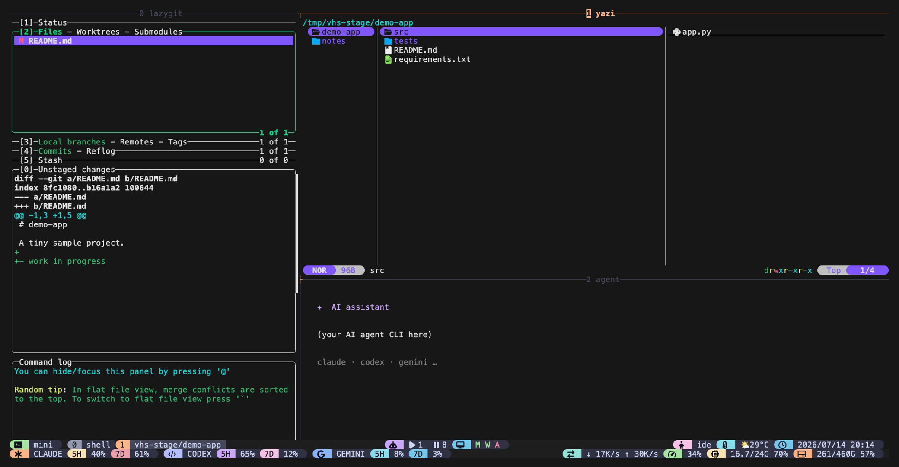

# tmux-workdesk（繁體中文說明）

一個 tmux 的**版面切換器**。每個版面各自綁一個 prefix 鍵——按下去，視窗就照它
重新排列。預設不經過任何選單：`prefix + i` 開 IDE 版面、`prefix + g` 開 2×2
grid，以此類推。重點是版面本身；pane 裡要跑什麼，你自己決定。



*每個版面都只差一個 prefix 鍵：`prefix + i` 開啟 IDE 版面，`prefix + g` 把目前視窗排成 2×2 grid。*

## 這是什麼？

tmux 本來就能用 `prefix + Space` 循環內建版面，但那些版面是泛用、沒有名字的。
tmux-workdesk 給你**每個有名字的版面各自一個 prefix 鍵**，套用在目前視窗上
（IDE 版面則是專屬視窗）：

- **IDE 版面**——四格形狀：一個窄的左側邊欄、一個主工作區、下方一條 strip，
  還有一個右欄。預設是**純 shell**——想要的話可以把各格指到你自己的工具
  （見下面）。開啟時是專屬的 `ide` 視窗，之後可以切回去；它是獨立的工作區，
  不屬於下面的幾何版面循環。
- **幾何版面**——以下每一種都是套在兩個基本元件上的簡單命名別名：
  - `tile X Y`——排出 X×Y 格 pane。
  - `main {v|h} <pct> [n]`——一格 pane 佔視窗的 `<pct>`%（`v` = 靠左那欄、`h` =
    靠上那列），其餘的堆在旁邊／下面；`n` 可強制 pane 數（預設 2）。

  | 版面 | 對應基本元件 | 形狀 |
  |---|---|---|
  | **grid** | `tile 2 2` | 四格等大、tiled |
  | **columns** | `tile N 1`（`@workdesk-columns-count`，預設 4） | N 欄等寬並排 |
  | **rows** | `tile 1 N`（`@workdesk-rows-count`，預設 3） | N 列等高堆疊、全寬 |
  | **fleet** | `tile auto auto` | 依現有 pane 數自動 tiled——「監看多格」用 |
  | **lead** | `main v 50` | 左邊一格 50% 寬的主格 + 右邊堆疊其餘 pane——agent 團隊的主力版面 |
  | **l3** / **Left │ 3-stack** | `main v 50 4` | 左半邊全高一格 + 右半邊三格堆疊 |
  | **mainh** | `main h 60` | 上方 60% 高的主格 + 下方一條 terminal strip |
  | **duo** | `tile 2 1` | 兩格等寬並排 |

  `tile X Y` 在 N×1（columns）、1×N（rows）、2×2（grid，4 格）這些情況下是精準的；
  強制指定非方形的 N×M（例如 `tile 3 2`）會退回 tmux 自己的 `tiled` 排列（接近
  方形，非精準格數）——這是已知的 v1 限制，不是 bug。

  命名版面沒涵蓋到的形狀，可以直接綁基本元件：

  ```tmux
  bind-key -T prefix X run-shell "'~/.tmux/plugins/tmux-workdesk/scripts/workdesk.sh' tile 3 1"
  bind-key -T prefix Y run-shell "'~/.tmux/plugins/tmux-workdesk/scripts/workdesk.sh' main v 70"
  ```

  怎麼選：grid／fleet 適合等重地監看多格；**lead**（一格主力 + 右邊堆疊
  worker）是帶 agent 團隊的首選版面；columns／rows／duo／mainh 則是常見的
  等分排法。
- **Focus**——一個鍵把目前 active pane 放大（再按一次還原），是上面版面的
  「監看多格、聚焦一格」互補動作。
- **Cycle**（選用）——一個鍵讓目前視窗依序跳到 `@workdesk-cycle-ring`（預設
  `grid columns rows`）指定的下一個版面，如果你比較想要「換下一個版面」而不是
  每個版面各自一個鍵。

**幾何版面**（grid / columns / rows / fleet / lead / l3 / mainh / duo）作用在
**目前**視窗上：它們會先加入純 shell 的 pane，直到數量夠了，再套用排列。過程中
不會殺掉任何 pane，所以同一批 pane 連同內容都會留著——幾何版面之間切換是無縫
的。IDE 版面不一樣：它會開一個專屬視窗，不屬於那個切換循環。

另外還有一個列出所有版面的彈出式選單——它是**選用**的（需要 tmux 3.0+），不是
預設的操作入口；細節見下面的〈選項〉。

```
   IDE layout            2×2 grid           Columns          Left │ 3-stack
+----+------+----+    +------+------+    +--+--+--+--+     +--------+--------+
|    | main |    |    |      |      |    |  |  |  |  |     |        |   R1   |
|    +------+    |    +------+------+    |  |  |  |  |     |   L    +--------+
|    | strip|    |    |      |      |    |  |  |  |  |     |        |   R2   |
+----+------+----+    +------+------+    +--+--+--+--+     |        +--------+
                                                          |        |   R3   |
                                                          +--------+--------+
```

（rows、fleet、lead、mainh、duo 都是上面同一組 `tile`／`main` 形狀——細節見
上方版面表。）

## IDE 版面——自己帶工具進來

IDE 版面出廠時是那個形狀裡的**四個純 shell pane**。它不會啟動任何特定程式——
外掛提供的是*形狀*本身。要把它變成你的 IDE，在 `~/.tmux.conf` 裡把每一格指到
一個工具：

```tmux
# 範例——左邊放檔案管理器、strip 放 git TUI、右邊放 agent。
# 這些工具只是示範；你可以用任何你喜歡的（或什麼都不放）。
set -g @workdesk-left-cmd   'yazi'      # 終端檔案管理器
set -g @workdesk-bottom-cmd 'lazygit'   # git TUI
set -g @workdesk-right-cmd  'claude'    # AI 助手 CLI
set -g @workdesk-main-cmd   'nvim'      # 主 pane 裡的編輯器
```

每個 `@workdesk-<slot>-cmd` 都是可選的：

- **未設定或空字串** → 該格是純 shell（只有版面，沒有工具），
- **一個指令** → 該格跑那個指令（沒裝的話，該格會退回 shell 並提示原因），
- **`none`** → 丟棄該格，空間讓給鄰格。

> ⚠️ **格子的指令會執行程式。** 它們來自你自己的 `~/.tmux.conf`，但請比照你放進
> 設定檔的任何指令一樣謹慎看待。

## 快速上手

還不熟 tmux 的 `prefix` 鍵？預設 prefix 是 `Ctrl-b`——先按 `Ctrl-b` 放開，
再按下一個鍵。

需要 **tmux 2.4 以上**。二選一。

### 方式 A — 用 TPM（tmux 外掛管理器）

沒裝過 TPM 的話，先跑這三行（直接複製貼上）：

```sh
git clone https://github.com/tmux-plugins/tpm ~/.tmux/plugins/tpm
printf '\n%s\n' "run '~/.tmux/plugins/tpm/tpm'" >> ~/.tmux.conf
tmux source ~/.tmux.conf
```

（如果 tmux 還沒開，`tmux source` 可能會印出「no server running」——沒關係，
設定會在你下次開 tmux 時生效。）

接著在 `~/.tmux.conf` 裡、`run '~/.tmux/plugins/tpm/tpm'` 那行的**上面**，加：

```tmux
set -g @plugin 'operonlab/tmux-workdesk'
```

重新載入並安裝：

```sh
tmux source ~/.tmux.conf   # 1. 重新載入設定
# 2. 按下：prefix + I（大寫 i）下載外掛
```

### 方式 B — 不用 TPM（一行搞定）

隨便找個地方 clone，然後往 `~/.tmux.conf` 加一行：

```sh
git clone https://github.com/operonlab/tmux-workdesk ~/.tmux/plugins/tmux-workdesk
printf '%s\n' "run-shell '~/.tmux/plugins/tmux-workdesk/workdesk.tmux'" >> ~/.tmux.conf
tmux source ~/.tmux.conf
```

（如果 tmux 還沒開，`tmux source` 可能會印出「no server running」——沒關係，
設定會在你下次開 tmux 時生效。）

### 試玩

1. `cd` 進一個專案，開啟（或 attach）tmux。
2. 按 **`prefix + i`** → IDE 版面開啟成一個新的 `ide` 視窗。之後從任何地方再按
   一次，會直接跳回那個視窗——不會重建。
3. 按 **`prefix + g`** → 目前視窗排成 2×2 grid。

其他版面——columns、rows、l3、lead、mainh、duo、fleet、focus、cycle、彈出式
選單——預設都沒有綁鍵；自己挑喜歡的空鍵綁（見下面〈選項〉）：

```tmux
set -g @workdesk-columns-bind 'e'
set -g @workdesk-l3-bind      'a'
set -g @workdesk-lead-bind    'd'
set -g @workdesk-cycle-bind   'b'
```

> **注意：** 預設 `prefix + i` 會**覆蓋 tmux 內建的 `display-message` 按鍵**
> （一段單行的 pane 資訊訊息）。`prefix + g` 不會覆蓋任何東西——tmux 本來就
> 沒有預設綁這個鍵。如果你需要那段內建訊息，把 `@workdesk-ide-bind` 設成
> `none` 或改綁別的鍵。

## Demo


## 選項

以下都可省略，要設就設在 `~/.tmux.conf` 裡、外掛那行的**上面**。

| 選項 | 預設 | 白話說明 |
|---|---|---|
| `@workdesk-ide-bind` | `i` | 開啟／切回 IDE 版面的按鍵（接在 prefix 之後）。設成 `none` 可停用。**會覆蓋 tmux 內建的 `display-message` 按鍵。** |
| `@workdesk-grid-bind` | `g` | 把目前視窗排成 2×2 grid 的按鍵。設成 `none` 可停用。 |
| `@workdesk-columns-bind` | `none` | 把目前視窗排成 **Columns** 的按鍵。預設不綁——它天然的助記鍵 `c` 是 tmux 自己的 `new-window`；自己挑一個空鍵。 |
| `@workdesk-rows-bind` | `none` | 把目前視窗排成 **Rows** 的按鍵。預設不綁——自己挑一個空鍵。 |
| `@workdesk-l3-bind` | `none` | 把目前視窗排成 **Left │ 3-stack** 的按鍵。預設不綁——助記鍵 `l` 是 tmux 自己的 `last-window`；自己挑一個空鍵。 |
| `@workdesk-lead-bind` | `none` | 把目前視窗排成 **Lead + stack**（50% 寬主格 + 右邊堆疊 worker）的按鍵。預設不綁——自己挑一個空鍵。 |
| `@workdesk-mainh-bind` | `none` | 把目前視窗排成 **Main + terminal**（60% 高主格 + 下方一條 strip）的按鍵。預設不綁——自己挑一個空鍵。 |
| `@workdesk-duo-bind` | `none` | 把目前視窗排成 **Duo**（兩格等寬並排）的按鍵。預設不綁——自己挑一個空鍵。 |
| `@workdesk-fleet-bind` | `none` | 把目前視窗排成 **Fleet**（依現有 pane 數自動 tiled）的按鍵。預設不綁——自己挑一個空鍵。 |
| `@workdesk-focus-bind` | `none` | 把目前 active pane 放大／還原的按鍵。預設不綁——自己挑一個空鍵。 |
| `@workdesk-cycle-bind` | `none` | 選用的按鍵，讓目前視窗依序跳到 `@workdesk-cycle-ring` 指定的下一個版面，取代每個版面各自一個鍵。 |
| `@workdesk-menu-bind` | `none` | 選用的按鍵，開啟列出所有版面的彈出式 `display-menu`。**需要 tmux 3.0+**——預設不綁，讓外掛的核心路徑維持在 tmux 2.4 的底線上。 |
| `@workdesk-columns-count` | `4` | **Columns** 版面產生的欄數（限制在 2–8）。 |
| `@workdesk-rows-count` | `3` | **Rows** 版面產生的列數（限制在 2–8）。 |
| `@workdesk-cycle-ring` | `grid columns rows` | 空白分隔的版面名稱清單，`cycle` 依序在裡面跳（會繞回開頭；不認得的名稱會被跳過）。 |
| `@workdesk-window-name` | `ide` | IDE 版面視窗的名字。toggle 靠這個名字找它。 |
| `@workdesk-cwd` | *(觸發 pane 的路徑)* | IDE 版面以哪個目錄為根。預設是你按鍵時所在的位置。 |
| `@workdesk-main-cmd` | *(空 → shell)* | IDE 主工作區的指令。留空是純 shell。 |
| `@workdesk-left-cmd` | *(空 → shell)* | IDE 左格的指令。空字串 = 純 shell；`none` = 丟棄該格。 |
| `@workdesk-right-cmd` | *(空 → shell)* | IDE 右格的指令。空字串 = 純 shell；`none` = 丟棄該格。 |
| `@workdesk-bottom-cmd` | *(空 → shell)* | IDE 中下 strip 格的指令。空字串 = 純 shell；`none` = 丟棄該格。 |
| `@workdesk-left-width` | `20` | IDE 左格寬度，佔**整個視窗**的百分比。 |
| `@workdesk-right-width` | `30` | IDE 右格寬度，佔**整個視窗**的百分比。 |
| `@workdesk-bottom-height` | `30` | IDE strip 高度，佔**整個視窗**的百分比。 |
| `@workdesk-right-bottom-cmd` | *(空)* | 疊在 IDE 右格**下方**的第二個指令（可選）。留空 = 右欄維持一格。 |
| `@workdesk-right-bottom-height` | `50` | 右欄第二格的高度，佔**整個視窗**的百分比。 |

本外掛建立的每個 IDE 版面視窗都帶著 window option `@workdesk-window 1`。如果你有
自己的自動排版／rebalance hook，請檢查這個標記並跳過這些視窗——它們的 pane
比例是刻意排的。

### 更多 IDE 版面範例

左邊整條 git 面板、右邊上檔案樹疊 agent（*main* 格變成右上那格）：

```tmux
set -g @workdesk-left-cmd 'lazygit'
set -g @workdesk-left-width '33'
set -g @workdesk-main-cmd 'yazi'
set -g @workdesk-bottom-cmd 'claude'
set -g @workdesk-bottom-height '40'
set -g @workdesk-right-cmd 'none'
```

不要 AI 格——只要檔案 + 編輯器 + git：

```tmux
set -g @workdesk-right-cmd 'none'
set -g @workdesk-left-cmd 'yazi'
set -g @workdesk-bottom-cmd 'lazygit'
set -g @workdesk-main-cmd 'nvim'
set -g @plugin 'operonlab/tmux-workdesk'
```

## 解除安裝

跑內建的 teardown 腳本，解除各版面的按鍵綁定並關掉 IDE 視窗，然後刪掉資料夾：

```sh
~/.tmux/plugins/tmux-workdesk/scripts/teardown.sh
rm -rf ~/.tmux/plugins/tmux-workdesk
```

> ⚠️ teardown 會**殺掉 `ide` 視窗**，連帶關閉裡面所有在跑的東西。請先存好你的
> 工作。

（如果你用 TPM 安裝，也把 `~/.tmux.conf` 裡的 `set -g @plugin '.../tmux-workdesk'`
那行移除。）

## 常見問題

**我按了 `prefix + i`，結果只跳出一段視窗資訊訊息。**
那是 tmux 內建的 `prefix + i`（`display-message`）——外掛的綁定還沒載入。
重新載入設定（`tmux source ~/.tmux.conf`），若用 TPM 就按 `prefix + I`
（大寫 i）安裝。tmux-workdesk 載入後，`prefix + i` 就會改開 IDE 版面。

**我想要那個彈出式版面選單。**
它是選用的——把 `@workdesk-menu-bind` 設成一個空鍵即可（需要 tmux 3.0+）。
預設沒有選單，每個版面各自有自己的鍵。

**某個幾何版面（grid/columns/rows/…）加了空的 shell pane。**
這是設計如此——這些幾何版面會先加入純 shell 的 pane，直到數量夠了，再套用
排列。新 pane 裡想跑什麼都行。

**某個 IDE 格開成了純 shell，而不是我預期的程式。**
那格的指令不在 tmux 啟動時環境的 `PATH` 上。tmux-workdesk 會檢查每個 `*-cmd`
的第一個字，找不到就在那格開 shell，並印出
`workdesk: <cmd> not found, slot left as shell`。把工具裝好，或把選項指到
正確的執行檔。

**我想要少一點 IDE pane。**
把那格的指令設成 `none`（例如 `set -g @workdesk-right-cmd 'none'`）。
該次 split 會被跳過，空間讓給鄰格。

**再按一次 IDE 鍵又開了一個視窗——或者沒反應。**
它不該建第二個：toggle 會找名為 `@workdesk-window-name`（預設 `ide`）的視窗，
有就切過去。如果你手動改了 IDE 視窗的名字，tmux-workdesk 就找不到它、會重建
一個新的——把 `@workdesk-window-name` 改成一致，或別去改名。

**比例看起來差了一兩格。**
tmux 每條 pane 邊界會吃掉一格，所以 200 欄視窗的 20% / ~50% / 30% 會落在
40 / 98 / 60 欄（少掉的兩欄就是邊界）。這是正常的。

**佈局能撐過 tmux server 重啟嗎？**
這些視窗和 pane 就像其他視窗一樣活在跑著的 server 裡，所以
[tmux-resurrect](https://github.com/tmux-plugins/tmux-resurrect) 之類的設定可以
把它們救回來——但 tmux-workdesk 本身不在硬碟上留任何狀態。單純重啟後，再按一次
該版面的鍵即可（IDE 是 `prefix + i`、grid 是 `prefix + g`，以此類推）。

## 藍圖（Roadmap）

- **yazi → 主 pane**：如果你把 IDE 左格指到 yazi，就可以把 yazi 選中的檔案直接
  開進主工作區。做法（yazi opener 設定 ＋ 一段 `tmux send-keys` 橋接）寫在
  [docs/yazi-integration.md](yazi-integration.md)；**不內建**。

## 為什麼不叫 `tmux-ide`？

這個外掛開發期間短暫叫過 `tmux-ide`，但這名字已被好幾個彼此無關的專案取用——
最主要的是 [guysoft/tmux-ide](https://github.com/guysoft/tmux-ide)，另外還有
[wavyrai/tmux-ide](https://github.com/wavyrai/tmux-ide) 與
[sandeeprenjith/TMUX-IDE](https://github.com/sandeeprenjith/TMUX-IDE)。與其擠進
一個已經很擠的名字，本專案在首次發布前改名為 **tmux-workdesk**，與上述任何一個
專案都沒有關聯。

它也是不同性質的工具：guysoft/tmux-ide 是固定的 `nvim + opencode` IDE，附帶
nvim RPC socket 給 agent 驅動除錯；tmux-workdesk 是一個**版面切換器**——IDE 形狀
只是其中一種版面，本身不啟動任何工具，選項也放在 `@workdesk-*`（相對 guysoft 的
`@ide-*`），所以兩者同時啟用不會互相干擾。

## 致謝 / 授權

一組單一用途 tmux 小外掛家族的一員。以 [MIT License](../LICENSE) 釋出。
